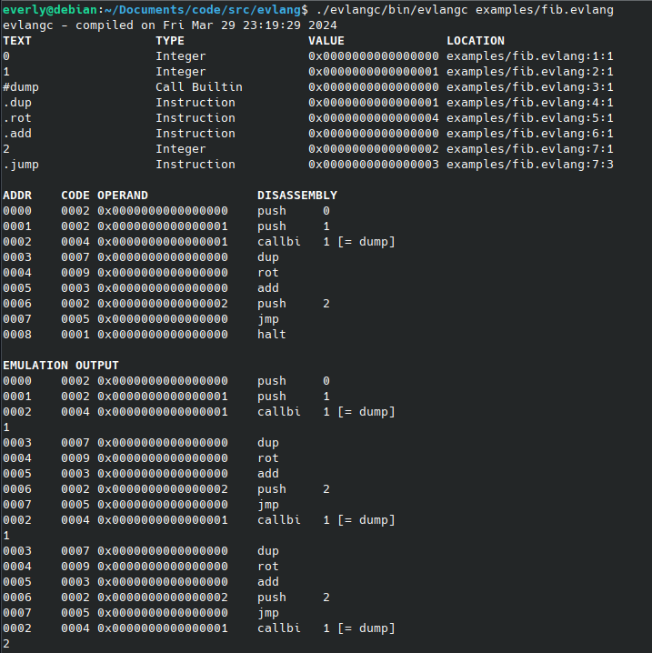

# evlang

Attempt at making my own programming language, inspired by [tsoding's porth](https://gitlab.com/tsoding/porth). \
This isn't meant to actually be used, rather a toy project for me to learn about language development and all the things that come with that!

# Quick Start

```console
$ make -C evlangc
$ ./evlangc/bin/evlangc examples/fib.evlang
```

# Screenshots

